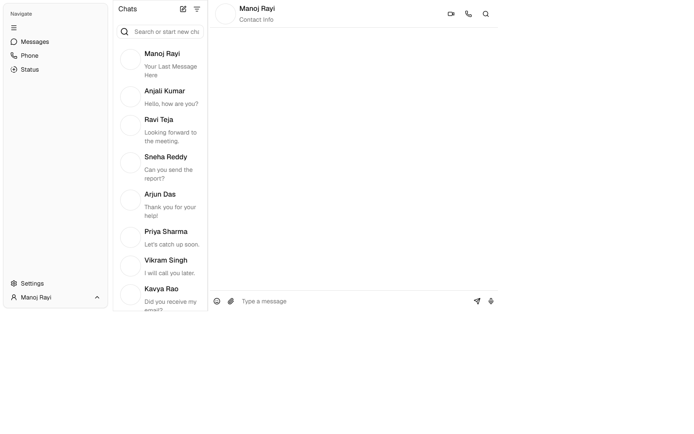
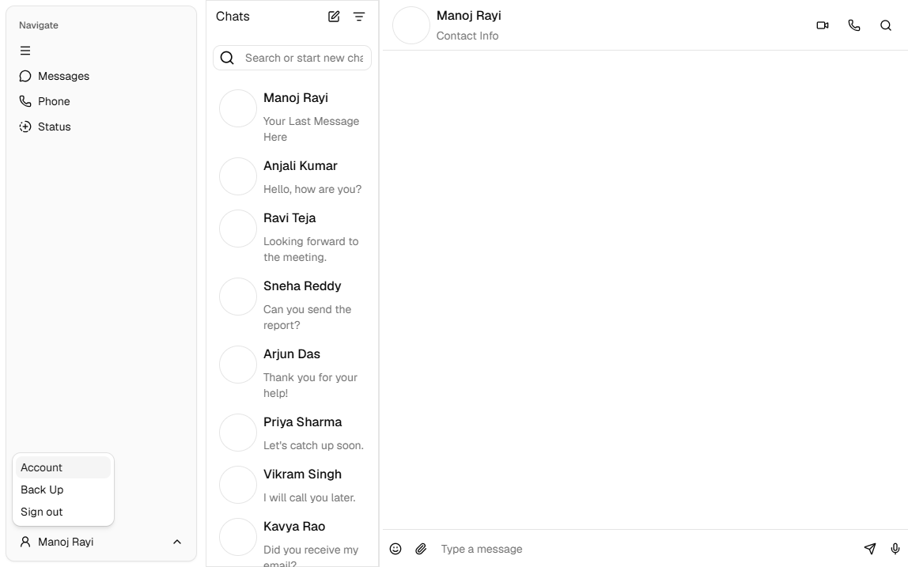

# Template original de chat

Dejo acá registrado el punto de partida de la interfaz antes de seguir adaptándola a Community Hub. Para reconstruirlo uso la versión que quedó en el commit [`d235a95`](https://github.com/valentin-bustamante/community-hub/blob/d235a95/apps/frontend/src/components/home.tsx), no la pantalla actual, que ya tiene cambios posteriores.

## Procedencia y licencia

El código original conserva imágenes servidas desde el CDN de [21st.dev](https://21st.dev/) y una cuenta de GitHub (`rayimanoj8`) en el menú de usuario. Eso sirve como pista de procedencia, pero el commit no incluye el enlace a la ficha específica del componente ni una atribución explícita. Por ese motivo no presento a esa cuenta como autor confirmado.

Tampoco encontré una licencia del template en el código ni en el commit. La licencia de las dependencias no alcanza para determinar la licencia de este diseño; antes de reutilizarlo fuera del TP habría que localizar la ficha original o consultar al proveedor.

## Qué incluía el original

La pantalla estaba hecha como un componente React dentro de Next.js. Usaba Tailwind CSS, componentes de shadcn/Radix, iconos de Lucide y paneles redimensionables.

La distribución tenía una navegación lateral con accesos a Messages, Phone y Status, además de Settings y un menú de cuenta. El área principal se dividía en dos paneles: a la izquierda, búsqueda, filtros de no leídos y borradores y una lista de contactos; a la derecha, el contacto seleccionado, acciones de llamada y una caja para escribir mensajes. Los contactos, nombres, avatares y textos eran datos de ejemplo definidos en el propio componente. No era un chat conectado a una API.

## Qué se adaptó para Community Hub

Al comparar esa versión con la actual, la navegación de Messages/Phone/Status y el bloque independiente de Settings/cuenta dejaron de estar en la barra lateral. El usuario autenticado y la acción para cerrar sesión ahora aparecen debajo de la lista de contactos. También se ajustó el área desplazable de esa lista para que pueda reducirse dentro del panel.

La lista de contactos y la conversación siguen siendo de muestra; esta pantalla no representa todavía comunidades, canales ni mensajes persistidos. Esos cambios corresponden a las tareas de adaptación de navegación y vista principal, no a la procedencia del template.

## Capturas del original

Las capturas se hicieron ejecutando el snapshot del commit `d235a95`, antes de los cambios posteriores de autenticación. La primera muestra la pantalla completa; la segunda, el menú de cuenta abierto. Dejé vacíos los avatares que venían del CDN de 21st.dev porque no encontré una licencia para redistribuir esas fotografías.

## Referencias para continuar

- [Versión original del componente en el commit `d235a95`](https://github.com/valentin-bustamante/community-hub/blob/d235a95/apps/frontend/src/components/home.tsx)
- [Componente adaptado actualmente](../apps/frontend/src/components/home.tsx)
- [Issue #4: Documentar template original](https://github.com/valentin-bustamante/community-hub/issues/4)
- [21st.dev](https://21st.dev/)
