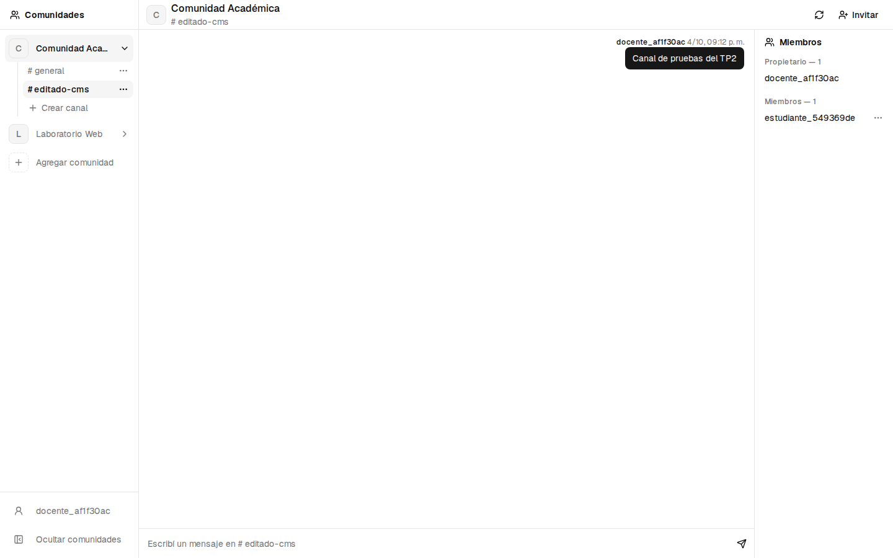
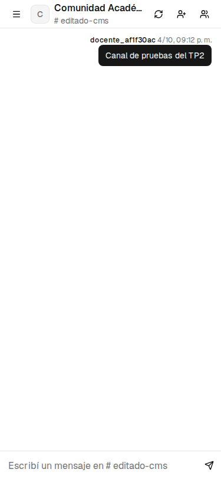
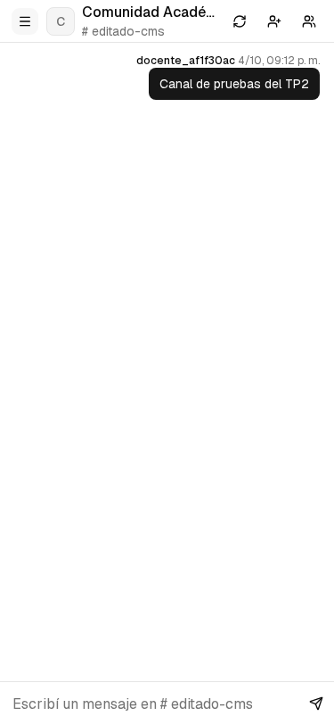

# Adaptación de la vista principal (T-14)

La aplicación reemplaza el contenido ficticio del template por información
persistida en Strapi. El encabezado identifica la comunidad y el canal; el
chat muestra sus mensajes y el panel lateral agrupa integrantes por rol.
La navegación y las acciones cambian según el contexto y la membresía.

## Cambios implementados

| Área | Comportamiento final |
| --- | --- |
| Contexto | Cambiar de comunidad descarta la selección previa de canal y las respuestas tardías. |
| Estados | Comunidades, canales, miembros y mensajes muestran carga, error y colección vacía. |
| Permisos | El propietario administra canales y miembros. El backend comprueba pertenencia y rol por recurso. |
| Datos del CMS | Actualizar comunidad recarga membresías, nombres, canales, integrantes y chat. |
| Contenido largo | Navegación con nombres truncados y mensajes con ajuste de palabras incluso sin espacios. |
| Teléfonos | Navegación y miembros en diálogos de Radix con foco, Tab y Escape. |
| Identidad | Título Community Hub, descripción, favicon e idioma español. |
| Sesión | Cierre explícito, limpieza ante 401 y errores de acceso en español. |

El icono opcional del CMS no se utiliza en la vista: se muestran iniciales.
Los administradores de comunidad se distinguen visualmente, pero solo el
propietario dispone de acciones de administración en este alcance.

## Comparación visual

El [template original](T-04-template-original.md) conserva su snapshot previo
y la procedencia. Las capturas actuales provienen de la ejecución documentada
en [T-16](T-16-pruebas-funcionales.md), con datos ficticios.

## Verificación

El recorrido automatizado comprueba registro, comunidades, canales, roles,
edición desde Content Manager, contenido largo, teclado y sesión inválida.
La matriz distingue datos reales y respuestas simuladas para revisar estados
que no deberían darse en una comunidad válida, como cero integrantes.

El informe detalla [las decisiones y limitaciones](INFORME-TP2.md).
